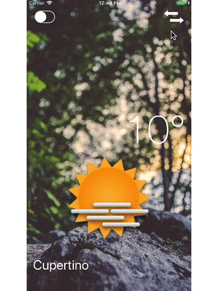

## Overview

The simple application Clima to show the weather at the user's current location and another city by using the API from [OpenWeatherMap](https://openweathermap.org/). The application uses:

    * [CocoaPods](https://cocoapods.org/) as a dependency manager.
    * [Alamofire](https://github.com/Alamofire/Alamofire) to do Networking.
    * [SwiftyJSON](https://github.com/SwiftyJSON/SwiftyJSON) to work with JSON data.
    * [SVProgressHud](https://github.com/SVProgressHUD/SVProgressHUD) to provide the progress indicators.

## Demo

